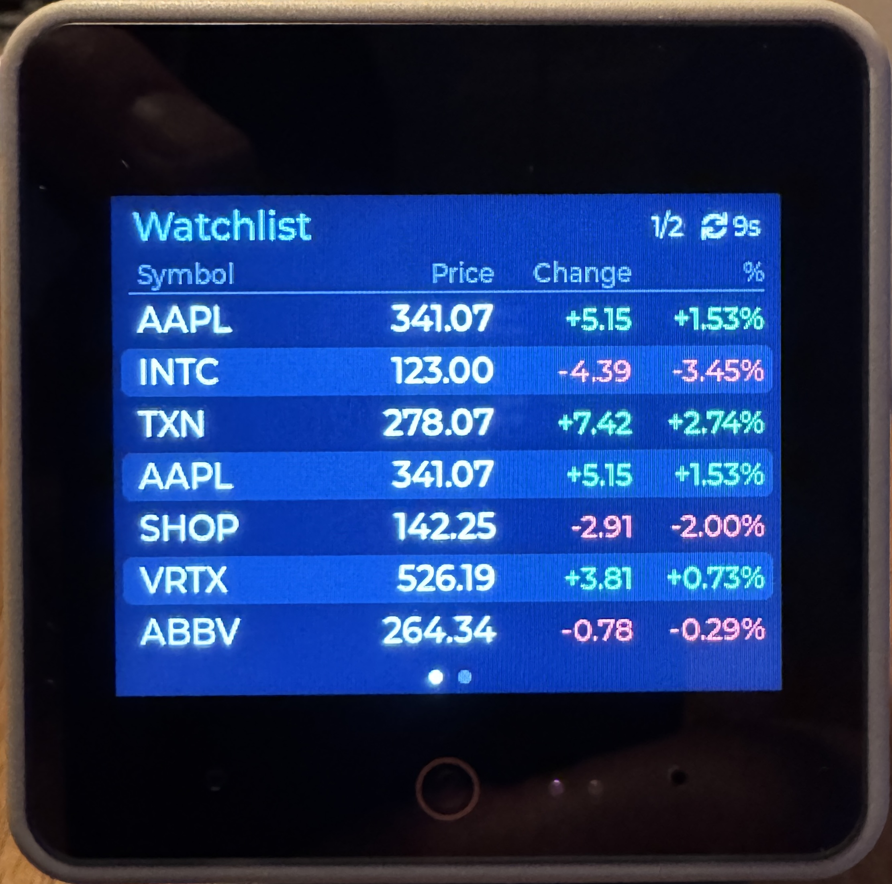
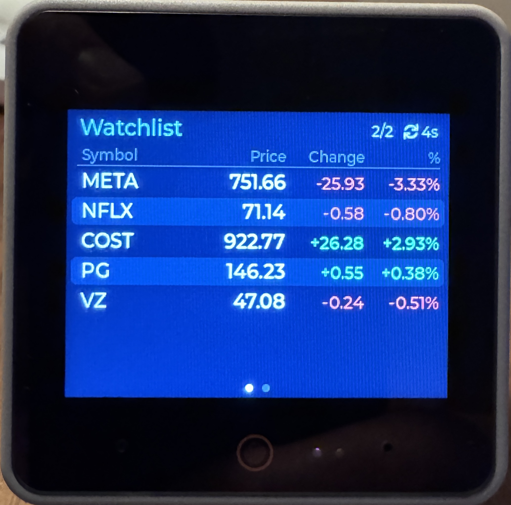
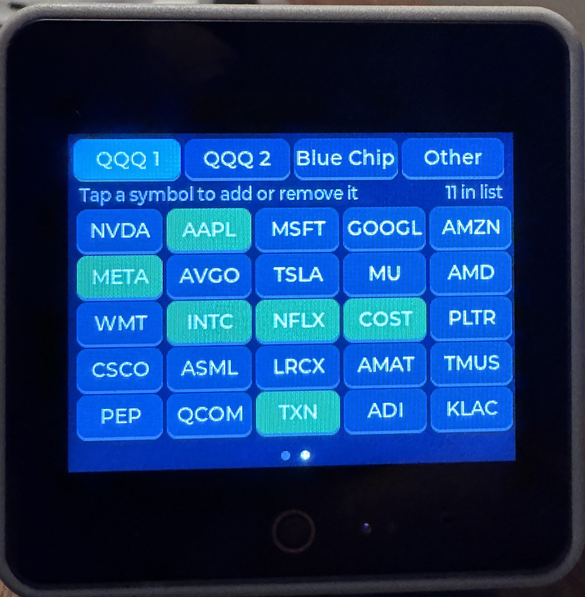
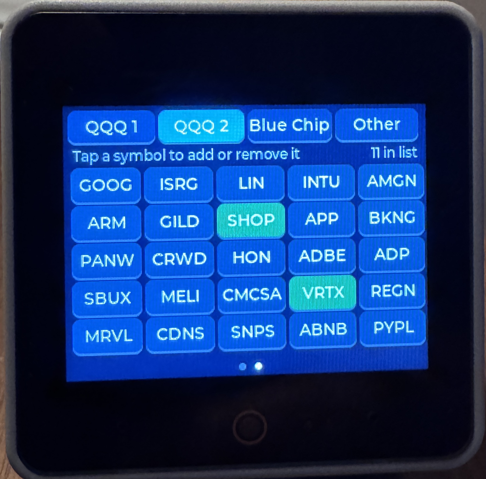
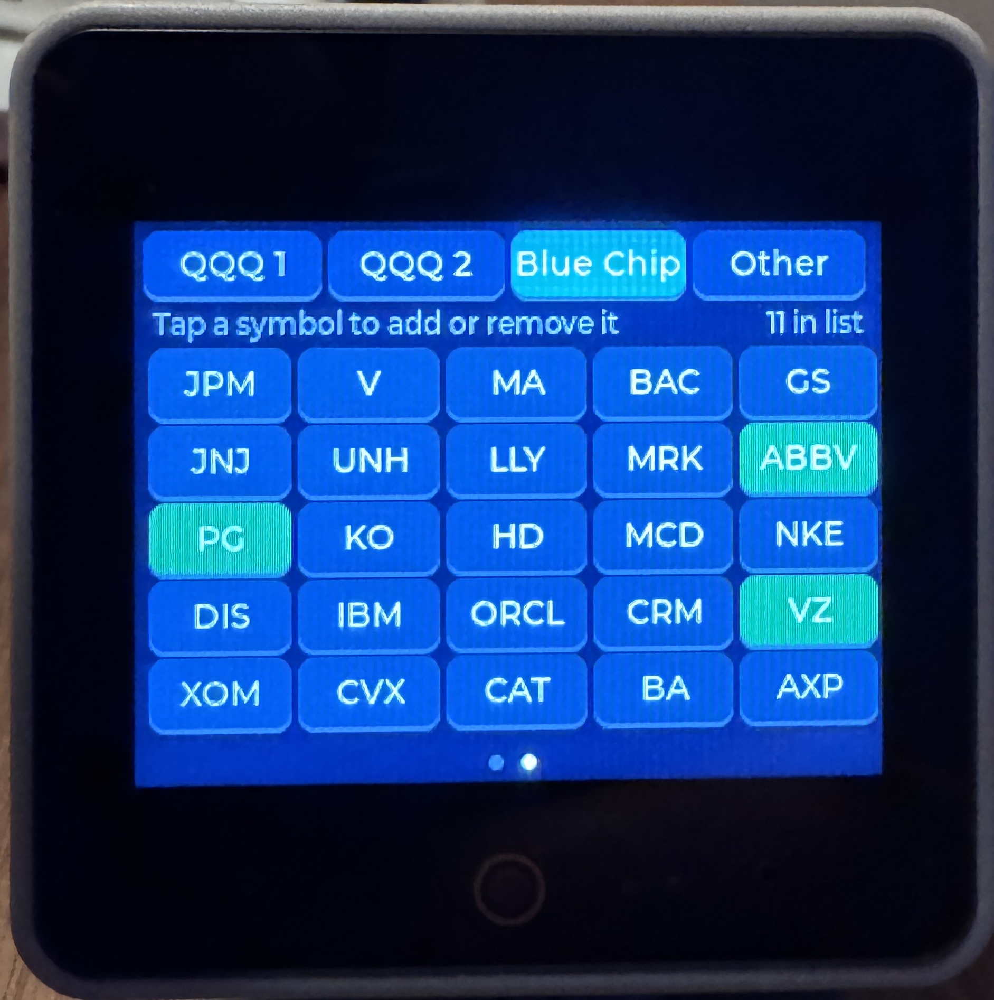

# Stock Watchlist

**Stock Watchlist** is a two-screen app for the M5Stack **StackChan**, written in MicroPython for **UIFlow2.0** with `m5ui` (LVGL 9). It is an MCP client for **FusionStockWatchListMCP**, an Amplify Fusion MCP server ([Amplify-Fusion-Stock-Watch-List-MCP](https://github.com/lbrenman/Amplify-Fusion-Stock-Watch-List-MCP)). It reads quotes from the server and adds or removes symbols by calling the server's tools over HTTP.

Swipe **left** or **right** to switch screens. Dots at the bottom show which screen you're on.

| # | Screen | What it does |
|---|--------|--------------|
| 1 | **Watchlist** | Symbol, price, change, and % change for every symbol, colored green or red. Refreshes every 30 s while visible. Symbols the server can't quote show "no quote". If there are more than 7 rows, pages rotate every 5 s. |
| 2 | **Pick** | Tabs of preset symbol buttons: **QQQ 1**, **QQQ 2**, **Blue Chip**, and **Other**. Tap a symbol to add it to the watchlist (the button turns green). Tap it again to remove it. **Other** lists watchlist symbols that aren't on the preset tabs, such as ones added from Claude, so you can remove them too. |

---

## Screen Shots

* Watch List
  
  
* Watch List Management




## Tested on

| | |
|---|---|
| **Device** | M5Stack StackChan (CoreS3-based: ESP32-S3, 320×240 touchscreen) |
| **Firmware** | UIFlow2.0 for StackChan v2.5.3, flashed with M5Burner |
| **IDE** | UiFlow2 web IDE ([uiflow2.m5stack.com](https://uiflow2.m5stack.com)), Python code view |

Tested end to end against FusionStockWatchListMCP: quotes, adding, removing, and the Other tab.

The app doesn't use the StackChan body (servos, LEDs, NFC), so it should also run on a plain CoreS3.

## Requirements

- StackChan flashed with **UIFlow2.0 for StackChan** (2.5.x API)
- Wi-Fi configured in UIFlow2 (**2.4 GHz only**)
- A running **FusionStockWatchListMCP** server, with its URL and API key. The server is an Amplify Fusion project; see [Amplify-Fusion-Stock-Watch-List-MCP](https://github.com/lbrenman/Amplify-Fusion-Stock-Watch-List-MCP) for how to set it up.

## Run it

> ⚠️ **Edit `stock-watchlist.py` before running.** The file in this repo contains placeholders, not a working server address or key:
>
> ```python
> MCP_URL = "https://YOUR-FUSION-HOST:4443/FusionStockWatchListMCP"
> MCP_API_KEY = "YOUR-API-KEY"
> ```
>
> Replace them with the URL and `x-api-key` value of your [FusionStockWatchListMCP server](https://github.com/lbrenman/Amplify-Fusion-Stock-Watch-List-MCP) in the copy you paste into UiFlow2. Until you do, both screens show "Set MCP_URL and MCP_API_KEY in CONFIG". Don't commit your real key to GitHub.

1. Open [uiflow2.m5stack.com](https://uiflow2.m5stack.com) and connect to your StackChan.
2. Create a new project, switch to the **Python** code view, and paste in all of `stock-watchlist.py`.
3. **Edit the CONFIG section at the top with your server's URL and API key** (see the box below).
4. Click **Run Once** and watch the console. Click **Download** to make it the program that runs at boot.

## Configuration

All settings are in the `CONFIG` block at the top of the file.

| Setting | Default | Notes |
|---|---|---|
| `MCP_URL` | `https://YOUR-FUSION-HOST:4443/FusionStockWatchListMCP` | **Required.** Streamable HTTP endpoint of your FusionStockWatchListMCP server. |
| `MCP_API_KEY_HEADER` / `MCP_API_KEY` | `x-api-key` / `YOUR-API-KEY` | **Required.** API key sent with every request. Keep your real key out of the repo. |
| `MCP_PROTOCOL` | `2025-03-26` | MCP protocol version requested in `initialize`. |
| `HTTP_CLIENT` | `"socket"` | `"socket"` uses the app's own HTTP/1.1 client. `"requests"` uses the firmware's `requests2`/`urequests` library. |
| `HTTP_TIMEOUT_S` | `15` | Socket timeout per request. |
| `DEBUG` | `True` | Prints every MCP request and the first 300 characters of each response to the console. |
| `TOOL_NAMES` | FusionStockWatchListMCP names | Tool used for each role (`quotes`, `list`, `add`, `remove`). Set a role to `None` to discover it automatically instead. |
| `REFRESH_MS` | 30 s | Quote refresh interval while the Watchlist screen is visible. |
| `RETRY_MS` | 15 s | Retry delay after a failed request. |
| `PAGE_MS` | `5000` | Page rotation interval when the rows don't fit on one screen. |
| `ROWS_PER_PAGE` | `7` | Rows per page. 7 is the most that fits above the page dots. |
| `SYMBOL_GROUPS` | QQQ 1, QQQ 2, Blue Chip | Tabs on the Pick screen: `(tab name, (symbols...))`, up to 25 symbols per tab. Edit freely. Keep tab names short: four tabs share the 320 px width. |
| `OTHER_TAB` | `"Other"` | Name of the tab for watchlist symbols that aren't in any group. |
| `SWIPE_ANIM_MS` | `250` | Length of the slide animation between screens. |

---

## The MCP server

The server side is an Amplify Fusion MCP server. Its source and setup instructions are in [lbrenman/Amplify-Fusion-Stock-Watch-List-MCP](https://github.com/lbrenman/Amplify-Fusion-Stock-Watch-List-MCP).

### Tools and their replies

FusionStockWatchListMCP has six tools. The app uses four of them. Every reply is a single `text` content item, and **`isError` is always `false`**, even when the message reports a failure.

| Role | Tool | Arguments | Reply text |
|---|---|---|---|
| `quotes` | `GetStockWatchList` | none | JSON: `{"Watchlist":[{"Symbol":"AAPL","Name":"Apple Inc","Price":341.07,"Change":5.15,"ChangePercent":1.5331}, ...]}` |
| `list` | `GetStockWatchListSymbols` | none | Plain text: `AAPL,INTC,TXN` |
| `add` | `AddSymbolToStockWatchList` | `{"symbol":"AAPL"}` | `Symbol AAPL successfully added` or `Symbol already exists` |
| `remove` | `RemoveSymbolFromStockWatchList` | `{"symbol":"AAPL"}` | `Successfully removed AAPL from watch list` or `Error deleting symbol from watch list` |
| — | `GetStockQuote` | `{"symbol":"AAPL"}` | Not used. |
| — | `RemoveAllSymbolsFromStockWatchList` | none | **Never called.** |

The empty-watchlist replies haven't been captured yet. The app treats `""`, `null`, `{"Watchlist":[]}`, `{"Watchlist":null}`, and any non-error message (such as "No symbols…") as an empty list. Text containing error, fail, invalid, or not found is shown as an error.

### Server behaviors the app works around

| Behavior seen | What the app does |
|---|---|
| Failures come back with `isError: false` | `classify_reply()` reads the message text (success, already, error) and shows the result on the status line. |
| Unknown tickers (e.g. `ZZZZZ`) are **accepted**. They appear in the symbol list but are silently left out of the quotes. | The Pick screen only offers preset symbols. Unknown tickers added elsewhere show as "no quote" rows on the Watchlist and appear on the **Other** tab, so you can remove them. |
| Duplicate adds sometimes succeed (the list can hold AAPL twice) | The app only sends an add when the symbol isn't in its copy of the list. If a symbol is listed twice, one tap removes one copy, and the button stays green until you tap again. |
| The symbol is echoed as sent (`Symbol a successfully added`) | The app only sends uppercase symbols. |

These would be better fixed in the Fusion flow: return `isError: true` on failures, validate tickers before adding, and make the duplicate check reliable.

---

## How it works

### Architecture

```
ScreenManager                 owns the service, pages, swipe navigation, main loop
 ├─ WatchlistService          tool calls + reply parsing + cached symbols/quotes
 │   └─ McpClient             initialize / tools/list / tools/call (JSON-RPC)
 │       └─ http_post()       own HTTP/1.1-over-TLS client (or requests2)
 ├─ WatchlistScreen(Screen)   screen 1
 └─ PickScreen(Screen)        screen 2
```

The `Screen` base class uses the same lifecycle as Kitchen Sink Demo's `App`: `build(page)` runs once, `on_enter()` runs when the screen appears, `tick()` runs every ~10 ms while it's visible, and `on_exit()` runs when you swipe away. It adds one hook, `background()`, which the manager calls for **every** screen on every loop pass, visible or not. Both screens reach the shared `WatchlistService` through `self.svc`.

Swipes work the same way as in Kitchen Sink Demo. The page's `GESTURE` callback only records the direction, and the main loop switches with `screen_load_anim`. Scrolling is off on every page, and all buttons have `GESTURE_BUBBLE` set so that swipes still reach the page.

### MCP over HTTP ("Streamable HTTP")

MCP messages are JSON-RPC 2.0. Each request is a single HTTP `POST` to `MCP_URL`:

```
POST /FusionStockWatchListMCP HTTP/1.1
Host: YOUR-FUSION-HOST:4443
x-api-key: ...
Content-Type: application/json
Accept: application/json, text/event-stream
Mcp-Session-Id: <from initialize>
Connection: close

{"jsonrpc":"2.0","id":3,"method":"tools/call","params":{"name":"GetStockWatchList","arguments":{}}}
```

1. **`initialize`**: the server returns an `Mcp-Session-Id` header, which the client sends with every later request.
2. **`notifications/initialized`**: a notification with no `id`, so there is no reply.
3. **`tools/list`**: runs once. The tools are printed to the console and mapped to roles.
4. **`tools/call`**: one call per refresh, add, or remove.

FusionStockWatchListMCP answers as **SSE** (`event: message` / `data: {...}`) with a `Content-Length` header, though tool calls have also come back as plain JSON. `parse_rpc_reply()` handles both and picks the message whose `id` matches the request.

If a request fails with a transport error (a network error or timeout, or HTTP 404 for an expired session), the client reconnects with a fresh `initialize` and retries once. If the server answered (a JSON-RPC `error`, or a tool error), the client doesn't retry, so an add is never sent twice.

### The HTTP client

MicroPython's `urequests` sends **HTTP/1.0** requests, and has trouble reading response headers and chunked bodies. FusionStockWatchListMCP sits behind **Envoy**, which by default rejects HTTP/1.0. To avoid depending on the firmware library, `http_post_socket()` is a small HTTP/1.1 client:

- It opens a socket, wraps it in TLS (`ssl.SSLContext`, falling back to `ssl.wrap_socket`), and sends the request with `Connection: close`.
- It reads the status line and headers with `readline()`, then reads the body by `Content-Length`, by chunked encoding, or until the server closes the connection.
- Each request uses a new connection with a TLS handshake (about 0.5–1 s on the ESP32-S3).

The TLS connection is encrypted but the **server certificate isn't verified**, because the device has no CA bundle. This is the same as `urequests`. Set `HTTP_CLIENT = "requests"` to go back to the firmware library.

### Screens

- The **Watchlist** screen calls `GetStockWatchList` every 30 s. On the first load it also calls `GetStockWatchListSymbols` once, so that symbols without a quote can be shown as "no quote" rows. The rows are 7 sets of labels created once; only their text and colors change.
- The Watchlist screen normally refreshes every 30 s. After a change on the Pick screen, it refreshes within about a second instead.
- The **Pick** screen reloads the symbol list each time you open it, so changes made elsewhere (for example, from Claude through the same MCP server) show up.

### Pick screen

- **Tabs.** Each group in `SYMBOL_GROUPS` gets a container with a 5×5 grid of buttons, all created once at startup. A tab switch just shows one container and hides the others.
- **Colors.** Green means the symbol is in the watchlist, gray means it isn't, and amber means an add or remove is in progress.
- **Tapping.** A tap only decides add or remove (from the app's copy of the list) and **queues** the request. The button turns amber right away. `background()` sends queued requests one at a time from the main loop, and each takes about 1 s. Touch is processed between requests, so you can tap several symbols in a row, and the queue keeps going if you swipe to the Watchlist.
- **Local updates.** Because the server always says `isError: false`, each reply's message decides the local update. `successfully added` and `already exists` mean the symbol is in the list. `Successfully removed` and `Error deleting` mean it isn't. When the queue is empty, the app re-reads the list once from the server to catch anything the messages missed, such as duplicates.
- **Swipe safety.** Symbol buttons fire on `SHORT_CLICKED`, not `PRESSED`, so a swipe that starts on a symbol doesn't add or remove it. Tabs fire on `PRESSED`, since switching tabs by accident is harmless.
- **Other tab.** It's rebuilt only from the main loop, and only when its contents change, because deleting widgets from inside an LVGL event callback can crash LVGL.

### Preset symbols

`QQQ 1` and `QQQ 2` hold a curated set of about 50 of the largest Invesco QQQ (Nasdaq-100) holdings as of mid-2026, not an exact weight ranking. That includes Walmart, which moved to Nasdaq, and Micron, now a top-five holding. `Blue Chip` holds 25 large NYSE-listed companies that aren't in QQQ (banks, healthcare, consumer, energy, industrials). The Nasdaq-100 is rebalanced quarterly and reconstituted every December, so edit `SYMBOL_GROUPS` when you want to follow changes. Share classes with a dot (e.g. `BRK.B`) are left out because the quote service's format for them hasn't been tested.

---

## First run checklist

With `DEBUG = True`, the console shows every step. On the first **Run Once**, look for:

1. `MCP -> initialize`, then `MCP <- 200 event: message ...`: the HTTP client and TLS work.
2. `MCP connected: FusionStockWatchListMCP 1.0.0 | protocol 2025-03-26 | session <id>`
3. `Tool mapping ...`: the four roles show the tool names from the table above.
4. `MCP <- 200 ... {"Watchlist": ...`: quotes arrived.
5. After tapping a symbol: `add NVDA -> ok | Symbol NVDA successfully added`.

If something fails, the console prints a full traceback. Paste it here, starting from the first `MCP ->` line.

## Troubleshooting

| Symptom | Fix |
|---|---|
| **"Set MCP_URL and MCP_API_KEY in CONFIG"** | The placeholders are still in the file. Edit the CONFIG section (see [Run it](#run-it)). |
| **"bad HTTP reply" or a TLS/`ssl` error** | The socket client couldn't talk to the server. Send me the traceback, and try `HTTP_CLIENT = "requests"`. |
| **`ETIMEDOUT` / `[Errno 116]`** | No response within `HTTP_TIMEOUT_S`. Check Wi-Fi, or raise the timeout. |
| **"HTTP 401" / "HTTP 403"** | Check `MCP_API_KEY` and `MCP_API_KEY_HEADER`. |
| **"HTTP 426"** | The server wants a newer HTTP version. This happens with `HTTP_CLIENT = "requests"` (HTTP/1.0). Switch back to `"socket"`. |
| **"Tool operation not found for tool: ..."** | A name in `TOOL_NAMES` doesn't exist on the server. Compare it with the console's tool list. |
| **A button stays green after removing it** | The server had the symbol twice and removed one copy. Tap it again. |
| **"X wasn't in the server's list"** | The app's copy of the list was out of date. The button is now gray, and the list is re-read. |
| **"Still loading the watchlist..."** | Taps are ignored until the first list load succeeds, because the app has to know whether a tap means add or remove. |
| **Swiping on the grid adds or removes a symbol** | That shouldn't happen, because symbol buttons fire on `SHORT_CLICKED`. If it does on your firmware, send me the console output, and swipe from the tab bar in the meantime. |
| **A symbol on the Watchlist shows "no quote"** | The quote service doesn't know that symbol. Remove it from the **Other** tab, or from its preset tab. |
| **"unrecognised ... reply (see console)"** | The server's reply format changed. Send me the console line. |
| **UI freezes for a few seconds on first load** | The first load makes about 5 HTTPS requests, each with its own TLS handshake. Later refreshes make one. |
| **Brief freeze every 30 s** | That's the quote refresh, which blocks the loop for about 1 s. It only happens while the Watchlist screen is visible. |
| **"No Wi-Fi"** | Check your UIFlow2 Wi-Fi settings (2.4 GHz only). The app retries every 15 s. |

## Security

- This repo ships with **placeholders** for `MCP_URL` and `MCP_API_KEY`. Put your real values only in the copy on your device or in UiFlow2, and don't commit them. If a real key was ever pushed, rotate it on the Fusion server.
- The TLS server certificate isn't verified (see [The HTTP client](#the-http-client)).

## Known limitations and ideas

- Network calls **block** the loop, so taps and swipes are ignored while a request runs.
- The Pick screen only offers preset symbols. Change `SYMBOL_GROUPS` to add your own, or add symbols from Claude or Postman, and they'll appear on the **Other** tab.
- The Other tab shows up to 24 symbols. With more, the last slot shows "+N more".
- Taps are ignored while a request is in flight, because the loop is blocked. Buttons already queued keep going.
- The Watchlist screen shows the time until the next refresh, not the quote timestamp. The server's reply has no timestamp, and the app doesn't sync a clock.
- `Name` (e.g. "Apple Inc") is in the reply but isn't displayed, for lack of room. A detail screen could show it.
- Ideas: light StackChan's LEDs green or red with the day's overall move, nod when a symbol moves more than X%, or show a detail screen with the company name and a day chart.
